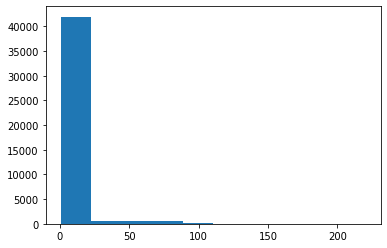
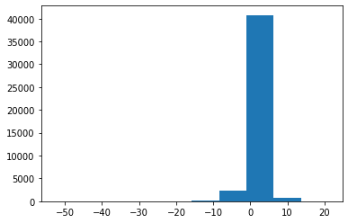
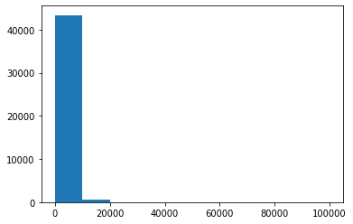
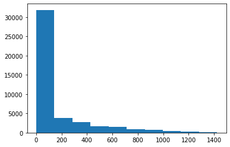
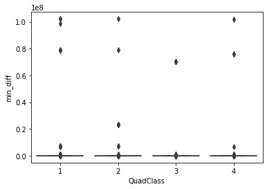
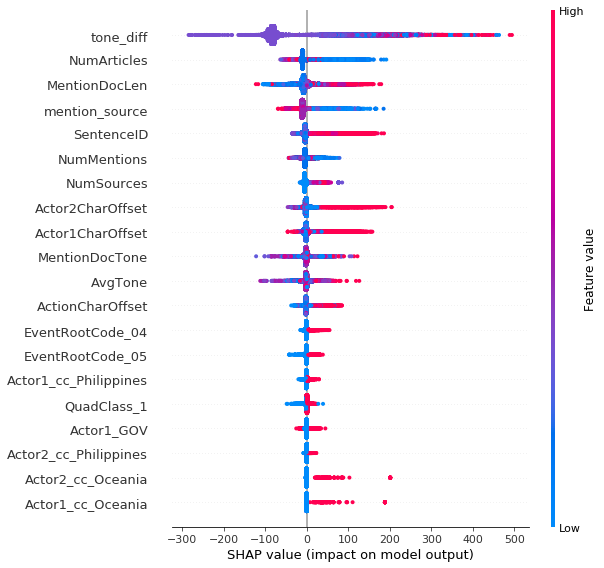

# Predicting Speed of News Dissemination using Machine Learning Algorithm

#### *LT6*


```python
import pandas as pd
# import dask.dataframe as dd
import matplotlib.pyplot as plt
import seaborn as sns
import numpy as np

from sklearn.tree import DecisionTreeRegressor
from sklearn.ensemble import RandomForestRegressor, GradientBoostingRegressor
import time
from sklearn.preprocessing import MinMaxScaler, StandardScaler
from sklearn.model_selection import GridSearchCV, cross_val_score
```


```python
from dask.distributed import Client
client = Client()
```


```python
client
```


<table style="border: 2px solid white;">
<tr>
<td style="vertical-align: top; border: 0px solid white">
<h3 style="text-align: left;">Client</h3>
<ul style="text-align: left; list-style: none; margin: 0; padding: 0;">
  <li><b>Scheduler: </b>tcp://127.0.0.1:43263</li>
  <li><b>Dashboard: </b><a href='http://127.0.0.1:8787/status' target='_blank'>http://127.0.0.1:8787/status</a>
</ul>
</td>
<td style="vertical-align: top; border: 0px solid white">
<h3 style="text-align: left;">Cluster</h3>
<ul style="text-align: left; list-style:none; margin: 0; padding: 0;">
  <li><b>Workers: </b>4</li>
  <li><b>Cores: </b>16</li>
  <li><b>Memory: </b>134.01 GB</li>
</ul>
</td>
</tr>
</table>


## Reading the working dataset


```python
df = pd.read_parquet('s3://bdcc-lab/df_merged.parquet')
```


```python
df.head()
```


<div>
<table border="1" class="dataframe">
  <thead>
    <tr style="text-align: right;">
      <th></th>
      <th>GlobalEventID</th>
      <th>EventTimeDate</th>
      <th>MentionTimeDate</th>
      <th>MentionType</th>
      <th>SentenceID</th>
      <th>Actor1CharOffset</th>
      <th>Actor2CharOffset</th>
      <th>ActionCharOffset</th>
      <th>MentionDocLen</th>
      <th>MentionDocTone</th>
      <th>...</th>
      <th>EventCode</th>
      <th>EventBaseCode</th>
      <th>EventRootCode</th>
      <th>QuadClass</th>
      <th>NumMentions</th>
      <th>NumSources</th>
      <th>NumArticles</th>
      <th>AvgTone</th>
      <th>mention_source</th>
      <th>mention_article</th>
    </tr>
  </thead>
  <tbody>
    <tr>
      <td>0</td>
      <td>813443217</td>
      <td>20190101040000</td>
      <td>20190101081500</td>
      <td>1</td>
      <td>6</td>
      <td>1546</td>
      <td>-1</td>
      <td>1527</td>
      <td>2227</td>
      <td>3.07692307692307</td>
      <td>...</td>
      <td>043</td>
      <td>043</td>
      <td>04</td>
      <td>1</td>
      <td>10</td>
      <td>1</td>
      <td>10</td>
      <td>-0.89514066496163</td>
      <td>10.0</td>
      <td>1.0</td>
    </tr>
    <tr>
      <td>1</td>
      <td>813443217</td>
      <td>20190101040000</td>
      <td>20190101040000</td>
      <td>1</td>
      <td>9</td>
      <td>-1</td>
      <td>3858</td>
      <td>3844</td>
      <td>4858</td>
      <td>-0.89514066496163</td>
      <td>...</td>
      <td>043</td>
      <td>043</td>
      <td>04</td>
      <td>1</td>
      <td>10</td>
      <td>1</td>
      <td>10</td>
      <td>-0.89514066496163</td>
      <td>10.0</td>
      <td>1.0</td>
    </tr>
    <tr>
      <td>2</td>
      <td>813443217</td>
      <td>20190101040000</td>
      <td>20190101080000</td>
      <td>1</td>
      <td>6</td>
      <td>1546</td>
      <td>-1</td>
      <td>1527</td>
      <td>2224</td>
      <td>3.07692307692307</td>
      <td>...</td>
      <td>043</td>
      <td>043</td>
      <td>04</td>
      <td>1</td>
      <td>10</td>
      <td>1</td>
      <td>10</td>
      <td>-0.89514066496163</td>
      <td>10.0</td>
      <td>1.0</td>
    </tr>
    <tr>
      <td>3</td>
      <td>813449194</td>
      <td>20190101053000</td>
      <td>20190101053000</td>
      <td>1</td>
      <td>8</td>
      <td>2553</td>
      <td>-1</td>
      <td>2587</td>
      <td>7011</td>
      <td>0.55658627087198</td>
      <td>...</td>
      <td>070</td>
      <td>070</td>
      <td>07</td>
      <td>2</td>
      <td>10</td>
      <td>1</td>
      <td>10</td>
      <td>0.55658627087198</td>
      <td>10.0</td>
      <td>1.0</td>
    </tr>
    <tr>
      <td>4</td>
      <td>813494031</td>
      <td>20190101143000</td>
      <td>20190101143000</td>
      <td>1</td>
      <td>14</td>
      <td>-1</td>
      <td>3746</td>
      <td>3738</td>
      <td>4024</td>
      <td>-2.42057488653555</td>
      <td>...</td>
      <td>020</td>
      <td>020</td>
      <td>02</td>
      <td>1</td>
      <td>10</td>
      <td>1</td>
      <td>10</td>
      <td>-2.42057488653555</td>
      <td>10.0</td>
      <td>1.0</td>
    </tr>
  </tbody>
</table>
<p>5 rows × 40 columns</p>
</div>


```python
df.shape
```


    (44069, 40)


### Data Preprocessing


```python
list_cols = ['GlobalEventID',
             'MentionTimeDate',
             "EventTimeDate",
             'MentionType',
             'SentenceID',
             'Actor1CharOffset',
             'Actor2CharOffset',
             'ActionCharOffset',
             'MentionDocLen',
             'MentionDocTone',
             'Day',
             'NumMentions',
             'NumSources',
             'NumArticles',
             'AvgTone',
             'mention_source',
             'mention_article']

for i in list_cols:
    df[i] = df[i].astype(float)
```


```python
df['tone_diff'] = df['MentionDocTone'].astype(float) - df['AvgTone'].astype(float)
```


```python
df['MentionTimeDate'] = df['MentionTimeDate'].apply(lambda x: pd.to_datetime(str(int(x)), format='%Y%m%d%H%M%S'))
df['EventTimeDate'] = df['EventTimeDate'].apply(lambda x: pd.to_datetime(str(int(x)), format='%Y%m%d%H%M%S'))
```

    distributed.comm.tcp - WARNING - Closing dangling stream in <TCP  local=tcp://127.0.0.1:37446 remote=tcp://127.0.0.1:43263>


```python
df['min_diff'] = df['MentionTimeDate'] - df['EventTimeDate']
```

    distributed.comm.tcp - WARNING - Closing dangling stream in <TCP  local=tcp://127.0.0.1:37448 remote=tcp://127.0.0.1:43263>


```python
df['min_diff'] = df['min_diff'].dt.seconds / 60
```


```python
df['mention_day'] = df['MentionTimeDate'].astype(str).map(lambda x: x[:-8])
```


```python
df.isnull().sum()
```


    GlobalEventID               0
    EventTimeDate               0
    MentionTimeDate             0
    MentionType                 0
    SentenceID                  0
    Actor1CharOffset            0
    Actor2CharOffset            0
    ActionCharOffset            0
    MentionDocLen               0
    MentionDocTone              0
    Day                         0
    Actor1Code               5244
    Actor1CountryCode       27066
    Actor1KnownGroupCode    43549
    Actor1EthnicCode        43911
    Actor1Religion1Code     42504
    Actor1Religion2Code     43752
    Actor1type1Code         20629
    Actor1type2Code         42659
    Actor1type3Code         44035
    Actor2Code              16620
    Actor2CountryCode       32768
    Actor2KnownGroupCode    43524
    Actor2EthnicCode        43955
    Actor2Religion1Code     41575
    Actor2Religion2Code     42561
    Actor2type1Code         28437
    Actor2type2Code         43012
    Actor2type3Code         44058
    IsRootEvent                 0
    EventCode                   0
    EventBaseCode               0
    EventRootCode               0
    QuadClass                   0
    NumMentions                 0
    NumSources                  0
    NumArticles                 0
    AvgTone                     0
    mention_source              0
    mention_article             0
    tone_diff                   0
    min_diff                    0
    mention_day                 0
    dtype: int64


### Feature Engineering


```python
from sklearn.feature_extraction.text import CountVectorizer
vec = CountVectorizer(lowercase=False, tokenizer=lambda x: x)

types1 = df.filter(regex=".*1type.*").fillna('').apply(list,axis=1)
types2 = df.filter(regex=".*2type.*").fillna('').apply(list,axis=1)

df_type1 = pd.DataFrame(vec.fit_transform(types1).todense(), columns=["Actor1_" + i for i in vec.get_feature_names()]).iloc[:, 1:]
df_type2 = pd.DataFrame(vec.fit_transform(types2).todense(), columns=["Actor2_" + i for i in vec.get_feature_names()]).iloc[:, 1:]
```


```python
df[df_type1.columns] = df_type1
df[df_type2.columns] = df_type2
```


```python
df['actor1_ethnic'] = df['Actor1EthnicCode'].isnull()
df['actor1_ethnic'] = df['actor1_ethnic'].apply(lambda x: 1 if x == 'False' else 0)

df['actor2_ethnic'] = df['Actor2EthnicCode'].isnull()
df['actor2_ethnic'] = df['actor2_ethnic'].apply(lambda x: 1 if x == 'False' else 0)

df['Actor1_Religion'] = df['Actor1Religion1Code'].isnull()
df['Actor1_Religion'] = df['Actor1_Religion'].apply(lambda x: 1 if x == 'False' else 0)

df['Actor2_Religion'] = df['Actor2Religion1Code'].isnull()
df['Actor2_Religion'] = df['Actor2_Religion'].apply(lambda x: 1 if x == 'False' else 0)
```


```python
df = df.set_index('GlobalEventID')
```


```python
import pycountry_convert as pc
from pycountry_convert import country_alpha3_to_country_alpha2
from pycountry_convert.convert_country_alpha2_to_continent_code import country_alpha2_to_continent_code
```


```python
def continent(code):
    manual_dict = {'SEA':"Asia", "EUR":"Europe", 'TMP': 'Asia', 'VA': 'Europe',
                  'AFR':'Africa', 'ASA':'South America', 'WST':'Oceania', 'SAS':'South America'}
    if code == "PHL":
        return "Philippines"
    try:
        code = pc.country_alpha3_to_country_alpha2(code)
        code = pc.country_alpha2_to_continent_code(code)
        country_continent_name = pc.convert_continent_code_to_continent_name(code)
    except KeyError:
        country_continent_name = manual_dict[code]
    return country_continent_name
```


```python
df['Actor1_cc'] = df['Actor1CountryCode'].apply(lambda x: continent(x) if x else x)
```


```python
df['Actor2_cc'] = df['Actor2CountryCode'].apply(lambda x: continent(x) if x else x)
```


```python
df_get_dum = pd.get_dummies(df, columns=['Actor1KnownGroupCode', 'Actor2KnownGroupCode'])
```


```python
to_drop = ['MentionTimeDate', 'EventTimeDate', 'MentionType',
            'mention_day',
            'Actor1Code',
             'Actor1CountryCode',
             'Actor1EthnicCode',
             'Actor1Religion1Code',
             'Actor1Religion2Code',
             'Actor1type1Code',
             'Actor1type2Code',
             'Actor1type3Code',
             'Actor2Code',
             'Actor2CountryCode',
             'Actor2EthnicCode',
             'Actor2Religion1Code',
             'Actor2Religion2Code',
             'Actor2type1Code',
             'Actor2type2Code',
             'Actor2type3Code',
            'EventCode',
             'EventBaseCode',
           'Day'
            ]
df_get_dum = df_get_dum.drop(columns=to_drop, errors='ignore')
```


```python
df_final = pd.get_dummies(df_get_dum)
```


```python
df_final.head()
```


<div>
<table border="1" class="dataframe">
  <thead>
    <tr style="text-align: right;">
      <th></th>
      <th>SentenceID</th>
      <th>Actor1CharOffset</th>
      <th>Actor2CharOffset</th>
      <th>ActionCharOffset</th>
      <th>MentionDocLen</th>
      <th>MentionDocTone</th>
      <th>NumMentions</th>
      <th>NumSources</th>
      <th>NumArticles</th>
      <th>AvgTone</th>
      <th>...</th>
      <th>Actor1_cc_Oceania</th>
      <th>Actor1_cc_Philippines</th>
      <th>Actor1_cc_South America</th>
      <th>Actor2_cc_Africa</th>
      <th>Actor2_cc_Asia</th>
      <th>Actor2_cc_Europe</th>
      <th>Actor2_cc_North America</th>
      <th>Actor2_cc_Oceania</th>
      <th>Actor2_cc_Philippines</th>
      <th>Actor2_cc_South America</th>
    </tr>
    <tr>
      <th>GlobalEventID</th>
      <th></th>
      <th></th>
      <th></th>
      <th></th>
      <th></th>
      <th></th>
      <th></th>
      <th></th>
      <th></th>
      <th></th>
      <th></th>
      <th></th>
      <th></th>
      <th></th>
      <th></th>
      <th></th>
      <th></th>
      <th></th>
      <th></th>
      <th></th>
      <th></th>
    </tr>
  </thead>
  <tbody>
    <tr>
      <td>813443217.0</td>
      <td>6.0</td>
      <td>1546.0</td>
      <td>-1.0</td>
      <td>1527.0</td>
      <td>2227.0</td>
      <td>3.076923</td>
      <td>10.0</td>
      <td>1.0</td>
      <td>10.0</td>
      <td>-0.895141</td>
      <td>...</td>
      <td>0</td>
      <td>0</td>
      <td>0</td>
      <td>0</td>
      <td>0</td>
      <td>0</td>
      <td>0</td>
      <td>0</td>
      <td>1</td>
      <td>0</td>
    </tr>
    <tr>
      <td>813443217.0</td>
      <td>9.0</td>
      <td>-1.0</td>
      <td>3858.0</td>
      <td>3844.0</td>
      <td>4858.0</td>
      <td>-0.895141</td>
      <td>10.0</td>
      <td>1.0</td>
      <td>10.0</td>
      <td>-0.895141</td>
      <td>...</td>
      <td>0</td>
      <td>0</td>
      <td>0</td>
      <td>0</td>
      <td>0</td>
      <td>0</td>
      <td>0</td>
      <td>0</td>
      <td>1</td>
      <td>0</td>
    </tr>
    <tr>
      <td>813443217.0</td>
      <td>6.0</td>
      <td>1546.0</td>
      <td>-1.0</td>
      <td>1527.0</td>
      <td>2224.0</td>
      <td>3.076923</td>
      <td>10.0</td>
      <td>1.0</td>
      <td>10.0</td>
      <td>-0.895141</td>
      <td>...</td>
      <td>0</td>
      <td>0</td>
      <td>0</td>
      <td>0</td>
      <td>0</td>
      <td>0</td>
      <td>0</td>
      <td>0</td>
      <td>1</td>
      <td>0</td>
    </tr>
    <tr>
      <td>813449194.0</td>
      <td>8.0</td>
      <td>2553.0</td>
      <td>-1.0</td>
      <td>2587.0</td>
      <td>7011.0</td>
      <td>0.556586</td>
      <td>10.0</td>
      <td>1.0</td>
      <td>10.0</td>
      <td>0.556586</td>
      <td>...</td>
      <td>0</td>
      <td>0</td>
      <td>0</td>
      <td>0</td>
      <td>0</td>
      <td>0</td>
      <td>0</td>
      <td>0</td>
      <td>0</td>
      <td>0</td>
    </tr>
    <tr>
      <td>813494031.0</td>
      <td>14.0</td>
      <td>-1.0</td>
      <td>3746.0</td>
      <td>3738.0</td>
      <td>4024.0</td>
      <td>-2.420575</td>
      <td>10.0</td>
      <td>1.0</td>
      <td>10.0</td>
      <td>-2.420575</td>
      <td>...</td>
      <td>0</td>
      <td>0</td>
      <td>0</td>
      <td>0</td>
      <td>0</td>
      <td>0</td>
      <td>0</td>
      <td>0</td>
      <td>0</td>
      <td>0</td>
    </tr>
  </tbody>
</table>
<p>5 rows × 152 columns</p>
</div>


## EDA


```python
df['MentionTimeDate'].value_counts()
```


    2.019013e+13    128
    2.019013e+13    121
    2.019013e+13    110
    2.019013e+13    109
    2.019021e+13    101
                   ...
    2.019031e+13      1
    2.019032e+13      1
    2.019030e+13      1
    2.019012e+13      1
    2.019011e+13      1
    Name: MentionTimeDate, Length: 7760, dtype: int64


```python
df['Day'].value_counts()
```


    20190127.0    4012
    20190213.0    1616
    20190128.0    1318
    20190221.0     792
    20190214.0     766
                  ...
    20180310.0       1
    20180322.0       1
    20180328.0       1
    20180222.0       1
    20180412.0       1
    Name: Day, Length: 205, dtype: int64


```python
df['MentionType'].value_counts()
```


    1.0    44069
    Name: MentionType, dtype: int64


```python
plt.hist(df['SentenceID']);
```





```python
df['SentenceID'].value_counts()
```


    1.0      7355
    2.0      5875
    3.0      4833
    4.0      3830
    7.0      2921
             ...
    202.0       1
    119.0       1
    220.0       1
    136.0       1
    219.0       1
    Name: SentenceID, Length: 121, dtype: int64


```python
plt.hist(df['tone_diff']);
```





```python

```


```python
plt.hist(df['day_diff']);
```





```python
df['day_diff'].value_counts()
```


    0.0        42935
    10000.0      678
    7.0          154
    1.0          122
    99.0          68
    102.0         35
    8899.0        21
    76.0          20
    79.0          18
    8876.0        11
    70.0           4
    99998.0        2
    73.0           1
    Name: day_diff, dtype: int64


```python
plt.hist(df['min_diff']);
```





```python
df['min_diff'].value_counts()
```


    0.0       25838
    15.0       1114
    30.0        873
    45.0        766
    60.0        690
              ...  
    1380.0       12
    1365.0       10
    1350.0       10
    1410.0        7
    1425.0        2
    Name: min_diff, Length: 96, dtype: int64


```python
df.groupby('QuadClass')['GlobalEventID'].count()
```


    QuadClass
    1    25002
    2     4830
    3     7100
    4     7137
    Name: GlobalEventID, dtype: int64


```python
sns.boxplot(x='QuadClass', y='min_diff', data=df_dropped)
```


    <matplotlib.axes._subplots.AxesSubplot at 0x7fca57a67160>





```python
df['Actor1type1Code'].unique()
```


    array([None, 'BUS', 'IMG', 'GOV', 'CVL', 'MIL', 'LEG', 'NGO', 'MED',
           'JUD', 'SPY', 'CRM', 'HLH', 'COP', 'IGO', 'EDU', 'LAB', 'AGR',
           'OPP', 'INS', 'REB', 'UAF', 'MNC', 'SEP', 'UIS', 'ELI', 'REF',
           'RAD', 'HRI', 'INT', 'ENV', 'SET'], dtype=object)


```python
df_final.to_parquet('s3://bdcc-lab/df_final.parquet')
```

## Setting up X and y


```python
X = df_final.drop(columns=['min_diff'])
y = df_final['min_diff']
```


```python
cols = X.columns
```


```python
# from regression_ria import regression
from sklearn.model_selection import train_test_split
```


```python
X_train, X_test, y_train, y_test = train_test_split(X, y, test_size=0.25, random_state=42)
```


```python
#No Scale
model1_noscale = regression(X_train, X_test, y_train, y_test, cols, scaler='None')
model1_noscale
```

    Training KNN


    /home/jbuno/.local/lib/python3.7/site-packages/joblib/externals/loky/process_executor.py:706: UserWarning: A worker stopped while some jobs were given to the executor. This can be caused by a too short worker timeout or by a memory leak.
      "timeout or by a memory leak.", UserWarning


    Training KNN complete in 22.950253009796143 seconds

    Training Linear Regression
    Training Linear Regression complete in 2.1495330333709717 seconds

    Training Linear SVM


    /home/jbuno/.local/lib/python3.7/site-packages/sklearn/svm/base.py:929: ConvergenceWarning: Liblinear failed to converge, increase the number of iterations.
      "the number of iterations.", ConvergenceWarning)


    Training Linear SVM complete in 36.04036855697632 seconds

    Training Decision Tree
    Training Decision Tree complete in 5.39584755897522 seconds

    Training Random Forest


    /home/jbuno/.local/lib/python3.7/site-packages/sklearn/ensemble/forest.py:245: FutureWarning: The default value of n_estimators will change from 10 in version 0.20 to 100 in 0.22.
      "10 in version 0.20 to 100 in 0.22.", FutureWarning)


    Training Random Forest complete in 19.93030285835266 seconds

    Training Gradient Boost
    Training Gradient Boost complete in 687.8933086395264 seconds


<div>
<table border="1" class="dataframe">
  <thead>
    <tr style="text-align: right;">
      <th></th>
      <th>Test Accuracy</th>
      <th>Train Accuracy</th>
      <th>Best Parameters</th>
      <th>Run Time</th>
      <th>0</th>
      <th>1</th>
      <th>2</th>
    </tr>
  </thead>
  <tbody>
    <tr>
      <td>KNN</td>
      <td>0.274568</td>
      <td>0.346445</td>
      <td>{'n_neighbors': 18}</td>
      <td>22.950253</td>
      <td>[nan]</td>
      <td>[nan]</td>
      <td>[nan]</td>
    </tr>
    <tr>
      <td>Linear Regression</td>
      <td>0.308882</td>
      <td>0.293509</td>
      <td>{}</td>
      <td>2.149533</td>
      <td>(mention_article, -160.82762178169762)</td>
      <td>(Actor1KnownGroupCode_WTO, 180.00211901377668)</td>
      <td>(Actor1KnownGroupCode_ADB, 205.95240565403984)</td>
    </tr>
    <tr>
      <td>Linear SVM</td>
      <td>-0.180616</td>
      <td>-0.191970</td>
      <td>{'tol': 1e-05}</td>
      <td>36.040369</td>
      <td>(EventRootCode_05, 35.453709327243374)</td>
      <td>(NumSources, 38.61501280255585)</td>
      <td>(IsRootEvent_0, 39.56197190222384)</td>
    </tr>
    <tr>
      <td>Decision Tree</td>
      <td>0.614025</td>
      <td>0.693964</td>
      <td>{'max_depth': 9}</td>
      <td>5.395848</td>
      <td>(SentenceID, 0.06152771297783498)</td>
      <td>(MentionDocLen, 0.06217580691685398)</td>
      <td>(tone_diff, 0.6474390502703469)</td>
    </tr>
    <tr>
      <td>Random Forest</td>
      <td>0.694756</td>
      <td>0.847753</td>
      <td>{'max_depth': 14}</td>
      <td>19.930303</td>
      <td>(SentenceID, 0.06152771297783498)</td>
      <td>(MentionDocLen, 0.06217580691685398)</td>
      <td>(tone_diff, 0.6474390502703469)</td>
    </tr>
    <tr>
      <td>Gradient Boost</td>
      <td>0.719004</td>
      <td>0.934718</td>
      <td>{'max_depth': 11}</td>
      <td>687.893309</td>
      <td>(SentenceID, 0.06152771297783498)</td>
      <td>(MentionDocLen, 0.06217580691685398)</td>
      <td>(tone_diff, 0.6474390502703469)</td>
    </tr>
  </tbody>
</table>
</div>


## With Scaling


```python
from sklearn.preprocessing import StandardScaler
from sklearn.preprocessing import MinMaxScaler
```


```python
mm=MinMaxScaler()
ss = StandardScaler()
```


```python
model1_ss = regression(X_train, X_test, y_train, y_test, cols, scaler='ss')
model1_ss
```

    Training KNN
    Training KNN complete in 570.2675330638885 seconds

    Training Linear Regression
    Training Linear Regression complete in 2.4082257747650146 seconds

    Training Linear SVM
    Training Linear SVM complete in 19.353331089019775 seconds

    Training Decision Tree
    Training Decision Tree complete in 8.501014709472656 seconds

    Training Random Forest


    /home/jbuno/.local/lib/python3.7/site-packages/sklearn/ensemble/forest.py:245: FutureWarning: The default value of n_estimators will change from 10 in version 0.20 to 100 in 0.22.
      "10 in version 0.20 to 100 in 0.22.", FutureWarning)


    Training Random Forest complete in 31.434056043624878 seconds

    Training Gradient Boost


    /home/jbuno/.local/lib/python3.7/site-packages/joblib/externals/loky/process_executor.py:706: UserWarning: A worker stopped while some jobs were given to the executor. This can be caused by a too short worker timeout or by a memory leak.
      "timeout or by a memory leak.", UserWarning


    Training Gradient Boost complete in 1250.0616290569305 seconds


<div>
<table border="1" class="dataframe">
  <thead>
    <tr style="text-align: right;">
      <th></th>
      <th>Test Accuracy</th>
      <th>Train Accuracy</th>
      <th>Best Parameters</th>
      <th>Run Time</th>
      <th>0</th>
      <th>1</th>
      <th>2</th>
    </tr>
  </thead>
  <tbody>
    <tr>
      <td>KNN</td>
      <td>5.029543e-01</td>
      <td>0.619186</td>
      <td>{'n_neighbors': 7}</td>
      <td>570.267533</td>
      <td>[nan]</td>
      <td>[nan]</td>
      <td>[nan]</td>
    </tr>
    <tr>
      <td>Linear Regression</td>
      <td>-2.222094e+20</td>
      <td>0.293498</td>
      <td>{}</td>
      <td>2.408226</td>
      <td>(Actor1_Religion, -481716879845749.3)</td>
      <td>(EventRootCode_04, 481860371493104.94)</td>
      <td>(QuadClass_3, 599949624479754.0)</td>
    </tr>
    <tr>
      <td>Linear SVM</td>
      <td>1.205777e-01</td>
      <td>0.107567</td>
      <td>{'tol': 0.021544346900318846}</td>
      <td>19.353331</td>
      <td>(ActionCharOffset, -73.8901609632675)</td>
      <td>(NumSources, 79.45781739166748)</td>
      <td>(NumArticles, -117.40894243959383)</td>
    </tr>
    <tr>
      <td>Decision Tree</td>
      <td>6.140247e-01</td>
      <td>0.693964</td>
      <td>{'max_depth': 9}</td>
      <td>8.501015</td>
      <td>(SentenceID, 0.06152771297783498)</td>
      <td>(MentionDocLen, 0.06217580691685398)</td>
      <td>(tone_diff, 0.6474390502703469)</td>
    </tr>
    <tr>
      <td>Random Forest</td>
      <td>6.947118e-01</td>
      <td>0.847756</td>
      <td>{'max_depth': 14}</td>
      <td>31.434056</td>
      <td>(SentenceID, 0.06152771297783498)</td>
      <td>(MentionDocLen, 0.06217580691685398)</td>
      <td>(tone_diff, 0.6474390502703469)</td>
    </tr>
    <tr>
      <td>Gradient Boost</td>
      <td>7.187324e-01</td>
      <td>0.934718</td>
      <td>{'max_depth': 11}</td>
      <td>1250.061629</td>
      <td>(SentenceID, 0.06152771297783498)</td>
      <td>(MentionDocLen, 0.06217580691685398)</td>
      <td>(tone_diff, 0.6474390502703469)</td>
    </tr>
  </tbody>
</table>
</div>


```python
model1_mm = regression(X_train, X_test, y_train, y_test, cols, scaler='mm')
model1_mm
```

    Training KNN
    Training KNN complete in 759.0364849567413 seconds

    Training Linear Regression
    Training Linear Regression complete in 2.419456958770752 seconds

    Training Linear SVM
    Training Linear SVM complete in 3.5382394790649414 seconds

    Training Decision Tree
    Training Decision Tree complete in 8.53028917312622 seconds

    Training Random Forest


    /home/jbuno/.local/lib/python3.7/site-packages/sklearn/ensemble/forest.py:245: FutureWarning: The default value of n_estimators will change from 10 in version 0.20 to 100 in 0.22.
      "10 in version 0.20 to 100 in 0.22.", FutureWarning)


    Training Random Forest complete in 31.62661600112915 seconds

    Training Gradient Boost


    /home/jbuno/.local/lib/python3.7/site-packages/joblib/externals/loky/process_executor.py:706: UserWarning: A worker stopped while some jobs were given to the executor. This can be caused by a too short worker timeout or by a memory leak.
      "timeout or by a memory leak.", UserWarning


    Training Gradient Boost complete in 1222.7480027675629 seconds


<div>
<table border="1" class="dataframe">
  <thead>
    <tr style="text-align: right;">
      <th></th>
      <th>Test Accuracy</th>
      <th>Train Accuracy</th>
      <th>Best Parameters</th>
      <th>Run Time</th>
      <th>0</th>
      <th>1</th>
      <th>2</th>
    </tr>
  </thead>
  <tbody>
    <tr>
      <td>KNN</td>
      <td>4.804588e-01</td>
      <td>0.605240</td>
      <td>{'n_neighbors': 7}</td>
      <td>759.036485</td>
      <td>[nan]</td>
      <td>[nan]</td>
      <td>[nan]</td>
    </tr>
    <tr>
      <td>Linear Regression</td>
      <td>-4.028656e+10</td>
      <td>0.293505</td>
      <td>{}</td>
      <td>2.419457</td>
      <td>(MentionDocTone, 125539178183705.66)</td>
      <td>(QuadClass_4, -130680061878684.56)</td>
      <td>(QuadClass_1, -168142130033265.06)</td>
    </tr>
    <tr>
      <td>Linear SVM</td>
      <td>-2.145293e-02</td>
      <td>-0.030540</td>
      <td>{'tol': 3.593813663804626}</td>
      <td>3.538239</td>
      <td>(SentenceID, 131.917310082157)</td>
      <td>(mention_source, -175.77642637834603)</td>
      <td>(NumSources, 192.2203646440512)</td>
    </tr>
    <tr>
      <td>Decision Tree</td>
      <td>6.140247e-01</td>
      <td>0.693964</td>
      <td>{'max_depth': 9}</td>
      <td>8.530289</td>
      <td>(SentenceID, 0.06152771297783498)</td>
      <td>(MentionDocLen, 0.06217580691685398)</td>
      <td>(tone_diff, 0.6474390502703469)</td>
    </tr>
    <tr>
      <td>Random Forest</td>
      <td>6.941800e-01</td>
      <td>0.847868</td>
      <td>{'max_depth': 14}</td>
      <td>31.626616</td>
      <td>(SentenceID, 0.06152771297783498)</td>
      <td>(MentionDocLen, 0.06217580691685398)</td>
      <td>(tone_diff, 0.6474390502703469)</td>
    </tr>
    <tr>
      <td>Gradient Boost</td>
      <td>7.203185e-01</td>
      <td>0.915262</td>
      <td>{'max_depth': 10}</td>
      <td>1222.748003</td>
      <td>(SentenceID, 0.06152771297783498)</td>
      <td>(MentionDocLen, 0.06217580691685398)</td>
      <td>(tone_diff, 0.6474390502703469)</td>
    </tr>
  </tbody>
</table>
</div>


```python
def regression(X_train, X_val, y_train, y_val, cols, scaler=None):
    kneighbors = range(1, 20)
    a = np.logspace(-5, 5, num=10)
    gamma_list = np.logspace(-5, 5, num=10)
    depth_settings = range(1, 15)
    tolerance = np.logspace(-5, 5, num=10)

#     knn = KNeighborsRegressor(n_jobs=1)
#     lin_reg = LinearRegression()
#     lasso = Lasso(alpha=a)
#     ridge = Ridge(alpha=a)
#     lin_svm = LinearSVR(random_state=0, tol=tolerance)
#     nsvm_poly = SVR(kernel='poly', degree=3)
    d_tree = DecisionTreeRegressor(random_state=0, max_depth=depth_settings)
    r_forest = RandomForestRegressor(max_depth=depth_settings, random_state=0)
#     g_boost = GradientBoostingRegressor(random_state=0, max_depth=depth_settings, learning_rate=0.1)

    est = [
#         ('KNN',knn,{'n_neighbors':kneighbors}),
#        ('Linear Regression',lin_reg,{}),
#       ('Linear SVM',lin_svm,{'tol':tolerance}),
      ('Decision Tree',d_tree,{'max_depth':depth_settings}),
      ('Random Forest',r_forest,{'max_depth':depth_settings}),
#       ('Gradient Boost',g_boost,{'max_depth':depth_settings}),
    ]

#     X_train, X_val, y_train, y_val = train_test_split(X, y,random_state=1)

    if scaler == 'ss':
        scale = StandardScaler()
        X_train = scale.fit_transform(X = X_train)
        X_val = scale.transform(X = X_val)
    elif scaler == 'mm':
        scale = MinMaxScaler()
        X_train = scale.fit_transform(X_train)
        X_val = scale.transform(X_val)
    else:
        pass

    models = {}
    for e in est:
        print(f'Training {e[0]}')
        start_time = time.time()
        gs_cv = GridSearchCV(e[1], param_grid=e[2], n_jobs=-1, cv=5)
        gs_cv.fit(X_train, y_train)
        end_time = time.time()
        elapsed_time = end_time - start_time
        models[e[0]] = gs_cv, elapsed_time
        print(f'Training {e[0]} complete in {elapsed_time} seconds \n')

    accuracy_summary ={}
    for m in models:
        test_acc = models[m][0].best_estimator_.score(X_val, y_val)
        train_acc = models[m][0].best_estimator_.score(X_train, y_train)
        best_param = models[m][0].best_params_
        accuracy_summary[m] = test_acc, train_acc, best_param, models[m][1]

    results_summary = pd.DataFrame.from_dict(accuracy_summary, orient='index', columns=['Test Accuracy', 'Train Accuracy', 'Best Parameters', 'Run Time'])

    #linear
    summary={}
#     methods_l = ['Linear Regression','Linear SVM']

#     for m in methods_l:
#         coefs = (models[m][0].best_estimator_.coef_)
#         top_3 = np.abs(coefs).argsort()[-3:]
#         if m=='Linear Regression':
#             coefs = coefs.flatten()
#             top_3 = top_3.flatten()[-3:]
#         pred = list(zip(cols[top_3],(coefs)[top_3]))
#         summary[m] = pred

    #ensamble
    methods_e = ['Decision Tree', 'Random Forest']
    pred = []
    for m in methods_e:
        coefs = [(cols[(models[m][0].best_estimator_.feature_importances_).argsort()[-3:]
                           ], models[m][0].best_estimator_.feature_importances_[
            (models[m][0].best_estimator_.feature_importances_).argsort()[-3:]])]

        coeff = list(zip(*coefs[0]))
        pred.append(coeff)
        summary[m] = pred[0]

        #no coeff
#     methods_no = ['KNN']
#     for m in methods_no:
#         summary[m] = [[np.nan],[np.nan],[np.nan]]

    df_summary_c1 = pd.DataFrame.from_dict(summary)
    return results_summary.join(df_summary_c1.T, how='left')
```


```python
model1_mm = regression(X_train, X_test, y_train, y_test, cols, scaler='mm')
model1_mm
```

    Training Decision Tree
    Training Decision Tree complete in 8.171297311782837 seconds

    Training Random Forest


    /home/jbuno/.local/lib/python3.7/site-packages/sklearn/ensemble/forest.py:245: FutureWarning: The default value of n_estimators will change from 10 in version 0.20 to 100 in 0.22.
      "10 in version 0.20 to 100 in 0.22.", FutureWarning)


    Training Random Forest complete in 31.00946283340454 seconds


<div>
<table border="1" class="dataframe">
  <thead>
    <tr style="text-align: right;">
      <th></th>
      <th>Test Accuracy</th>
      <th>Train Accuracy</th>
      <th>Best Parameters</th>
      <th>Run Time</th>
      <th>0</th>
      <th>1</th>
      <th>2</th>
    </tr>
  </thead>
  <tbody>
    <tr>
      <td>Decision Tree</td>
      <td>0.614025</td>
      <td>0.693964</td>
      <td>{'max_depth': 9}</td>
      <td>8.171297</td>
      <td>(SentenceID, 0.06152771297783498)</td>
      <td>(MentionDocLen, 0.06217580691685398)</td>
      <td>(tone_diff, 0.6474390502703469)</td>
    </tr>
    <tr>
      <td>Random Forest</td>
      <td>0.694180</td>
      <td>0.847868</td>
      <td>{'max_depth': 14}</td>
      <td>31.009463</td>
      <td>(SentenceID, 0.06152771297783498)</td>
      <td>(MentionDocLen, 0.06217580691685398)</td>
      <td>(tone_diff, 0.6474390502703469)</td>
    </tr>
  </tbody>
</table>
</div>


```python
model1_mm.best_estimator_.feature_importances_
```


    array([0., 0., 0., 0., 0., 0., 0., 0., 0., 0., 0., 0., 0., 1., 0., 0., 0.,
           0., 0., 0., 0., 0., 0., 0., 0., 0., 0., 0., 0., 0., 0., 0., 0., 0.,
           0., 0., 0., 0., 0., 0., 0., 0., 0., 0., 0., 0., 0., 0., 0., 0., 0.,
           0., 0., 0., 0., 0., 0., 0., 0., 0., 0., 0., 0., 0., 0., 0., 0., 0.,
           0., 0., 0., 0., 0., 0., 0., 0., 0., 0., 0., 0., 0., 0., 0., 0., 0.,
           0., 0., 0., 0., 0., 0., 0., 0., 0., 0., 0., 0., 0., 0., 0., 0., 0.,
           0., 0., 0., 0., 0., 0., 0., 0., 0., 0., 0., 0., 0., 0., 0., 0., 0.,
           0., 0., 0., 0., 0., 0., 0., 0., 0., 0., 0., 0., 0., 0., 0., 0., 0.,
           0., 0., 0., 0., 0., 0., 0., 0., 0., 0., 0., 0., 0., 0., 0., 0., 0.])


```python
model1_ss = regression(X_train, X_test, y_train, y_test, cols, scaler='ss')
model1_ss
```

    Training Decision Tree
    Training Decision Tree complete in 8.144410133361816 seconds

    Training Random Forest


    /home/jbuno/.local/lib/python3.7/site-packages/sklearn/ensemble/forest.py:245: FutureWarning: The default value of n_estimators will change from 10 in version 0.20 to 100 in 0.22.
      "10 in version 0.20 to 100 in 0.22.", FutureWarning)


    Training Random Forest complete in 31.0899019241333 seconds


<div>
<table border="1" class="dataframe">
  <thead>
    <tr style="text-align: right;">
      <th></th>
      <th>Test Accuracy</th>
      <th>Train Accuracy</th>
      <th>Best Parameters</th>
      <th>Run Time</th>
      <th>0</th>
      <th>1</th>
      <th>2</th>
    </tr>
  </thead>
  <tbody>
    <tr>
      <td>Decision Tree</td>
      <td>0.614025</td>
      <td>0.693964</td>
      <td>{'max_depth': 9}</td>
      <td>8.144410</td>
      <td>(SentenceID, 0.06152771297783498)</td>
      <td>(MentionDocLen, 0.06217580691685398)</td>
      <td>(tone_diff, 0.6474390502703469)</td>
    </tr>
    <tr>
      <td>Random Forest</td>
      <td>0.694712</td>
      <td>0.847756</td>
      <td>{'max_depth': 14}</td>
      <td>31.089902</td>
      <td>(SentenceID, 0.06152771297783498)</td>
      <td>(MentionDocLen, 0.06217580691685398)</td>
      <td>(tone_diff, 0.6474390502703469)</td>
    </tr>
  </tbody>
</table>
</div>


```python
model1_ = regression(X_train, X_test, y_train, y_test, cols)
model1_
```

    Training Decision Tree
    Training Decision Tree complete in 5.413174867630005 seconds

    Training Random Forest


    /home/jbuno/.local/lib/python3.7/site-packages/sklearn/ensemble/forest.py:245: FutureWarning: The default value of n_estimators will change from 10 in version 0.20 to 100 in 0.22.
      "10 in version 0.20 to 100 in 0.22.", FutureWarning)


    Training Random Forest complete in 19.931671619415283 seconds


<div>
<table border="1" class="dataframe">
  <thead>
    <tr style="text-align: right;">
      <th></th>
      <th>Test Accuracy</th>
      <th>Train Accuracy</th>
      <th>Best Parameters</th>
      <th>Run Time</th>
      <th>0</th>
      <th>1</th>
      <th>2</th>
    </tr>
  </thead>
  <tbody>
    <tr>
      <td>Decision Tree</td>
      <td>0.614025</td>
      <td>0.693964</td>
      <td>{'max_depth': 9}</td>
      <td>5.413175</td>
      <td>(SentenceID, 0.06152771297783498)</td>
      <td>(MentionDocLen, 0.06217580691685398)</td>
      <td>(tone_diff, 0.6474390502703469)</td>
    </tr>
    <tr>
      <td>Random Forest</td>
      <td>0.694756</td>
      <td>0.847753</td>
      <td>{'max_depth': 14}</td>
      <td>19.931672</td>
      <td>(SentenceID, 0.06152771297783498)</td>
      <td>(MentionDocLen, 0.06217580691685398)</td>
      <td>(tone_diff, 0.6474390502703469)</td>
    </tr>
  </tbody>
</table>
</div>


```python
X_test[y_test==0]
```


<div>
<table border="1" class="dataframe">
  <thead>
    <tr style="text-align: right;">
      <th></th>
      <th>SentenceID</th>
      <th>Actor1CharOffset</th>
      <th>Actor2CharOffset</th>
      <th>ActionCharOffset</th>
      <th>MentionDocLen</th>
      <th>MentionDocTone</th>
      <th>NumMentions</th>
      <th>NumSources</th>
      <th>NumArticles</th>
      <th>AvgTone</th>
      <th>...</th>
      <th>Actor1_cc_Oceania</th>
      <th>Actor1_cc_Philippines</th>
      <th>Actor1_cc_South America</th>
      <th>Actor2_cc_Africa</th>
      <th>Actor2_cc_Asia</th>
      <th>Actor2_cc_Europe</th>
      <th>Actor2_cc_North America</th>
      <th>Actor2_cc_Oceania</th>
      <th>Actor2_cc_Philippines</th>
      <th>Actor2_cc_South America</th>
    </tr>
    <tr>
      <th>GlobalEventID</th>
      <th></th>
      <th></th>
      <th></th>
      <th></th>
      <th></th>
      <th></th>
      <th></th>
      <th></th>
      <th></th>
      <th></th>
      <th></th>
      <th></th>
      <th></th>
      <th></th>
      <th></th>
      <th></th>
      <th></th>
      <th></th>
      <th></th>
      <th></th>
      <th></th>
    </tr>
  </thead>
  <tbody>
    <tr>
      <td>818321985.0</td>
      <td>1.0</td>
      <td>741.0</td>
      <td>-1.0</td>
      <td>708.0</td>
      <td>2064.0</td>
      <td>-2.967359</td>
      <td>10.0</td>
      <td>1.0</td>
      <td>10.0</td>
      <td>-2.967359</td>
      <td>...</td>
      <td>0</td>
      <td>0</td>
      <td>0</td>
      <td>0</td>
      <td>0</td>
      <td>0</td>
      <td>0</td>
      <td>0</td>
      <td>0</td>
      <td>0</td>
    </tr>
    <tr>
      <td>836404765.0</td>
      <td>4.0</td>
      <td>388.0</td>
      <td>351.0</td>
      <td>375.0</td>
      <td>1163.0</td>
      <td>4.419890</td>
      <td>10.0</td>
      <td>1.0</td>
      <td>10.0</td>
      <td>4.419890</td>
      <td>...</td>
      <td>0</td>
      <td>0</td>
      <td>0</td>
      <td>0</td>
      <td>0</td>
      <td>0</td>
      <td>0</td>
      <td>0</td>
      <td>1</td>
      <td>0</td>
    </tr>
    <tr>
      <td>823351909.0</td>
      <td>3.0</td>
      <td>481.0</td>
      <td>427.0</td>
      <td>387.0</td>
      <td>1849.0</td>
      <td>-6.000000</td>
      <td>10.0</td>
      <td>1.0</td>
      <td>10.0</td>
      <td>-6.000000</td>
      <td>...</td>
      <td>0</td>
      <td>1</td>
      <td>0</td>
      <td>0</td>
      <td>0</td>
      <td>0</td>
      <td>0</td>
      <td>0</td>
      <td>0</td>
      <td>0</td>
    </tr>
    <tr>
      <td>831244179.0</td>
      <td>25.0</td>
      <td>10431.0</td>
      <td>-1.0</td>
      <td>10458.0</td>
      <td>12396.0</td>
      <td>-1.529052</td>
      <td>10.0</td>
      <td>1.0</td>
      <td>10.0</td>
      <td>-1.529052</td>
      <td>...</td>
      <td>0</td>
      <td>1</td>
      <td>0</td>
      <td>0</td>
      <td>0</td>
      <td>0</td>
      <td>0</td>
      <td>0</td>
      <td>0</td>
      <td>0</td>
    </tr>
    <tr>
      <td>818857137.0</td>
      <td>7.0</td>
      <td>1456.0</td>
      <td>-1.0</td>
      <td>1472.0</td>
      <td>2001.0</td>
      <td>2.890173</td>
      <td>10.0</td>
      <td>1.0</td>
      <td>10.0</td>
      <td>2.890173</td>
      <td>...</td>
      <td>0</td>
      <td>0</td>
      <td>0</td>
      <td>0</td>
      <td>0</td>
      <td>0</td>
      <td>0</td>
      <td>0</td>
      <td>0</td>
      <td>0</td>
    </tr>
    <tr>
      <td>...</td>
      <td>...</td>
      <td>...</td>
      <td>...</td>
      <td>...</td>
      <td>...</td>
      <td>...</td>
      <td>...</td>
      <td>...</td>
      <td>...</td>
      <td>...</td>
      <td>...</td>
      <td>...</td>
      <td>...</td>
      <td>...</td>
      <td>...</td>
      <td>...</td>
      <td>...</td>
      <td>...</td>
      <td>...</td>
      <td>...</td>
      <td>...</td>
    </tr>
    <tr>
      <td>824841498.0</td>
      <td>1.0</td>
      <td>7.0</td>
      <td>-1.0</td>
      <td>36.0</td>
      <td>3208.0</td>
      <td>0.414079</td>
      <td>10.0</td>
      <td>1.0</td>
      <td>10.0</td>
      <td>0.414079</td>
      <td>...</td>
      <td>0</td>
      <td>0</td>
      <td>0</td>
      <td>0</td>
      <td>0</td>
      <td>0</td>
      <td>0</td>
      <td>0</td>
      <td>0</td>
      <td>0</td>
    </tr>
    <tr>
      <td>826243891.0</td>
      <td>1.0</td>
      <td>211.0</td>
      <td>326.0</td>
      <td>295.0</td>
      <td>1067.0</td>
      <td>0.621118</td>
      <td>10.0</td>
      <td>1.0</td>
      <td>10.0</td>
      <td>0.621118</td>
      <td>...</td>
      <td>0</td>
      <td>1</td>
      <td>0</td>
      <td>0</td>
      <td>0</td>
      <td>0</td>
      <td>0</td>
      <td>0</td>
      <td>0</td>
      <td>0</td>
    </tr>
    <tr>
      <td>829909698.0</td>
      <td>1.0</td>
      <td>156.0</td>
      <td>-1.0</td>
      <td>107.0</td>
      <td>1127.0</td>
      <td>2.793296</td>
      <td>10.0</td>
      <td>1.0</td>
      <td>10.0</td>
      <td>2.793296</td>
      <td>...</td>
      <td>0</td>
      <td>1</td>
      <td>0</td>
      <td>0</td>
      <td>0</td>
      <td>0</td>
      <td>0</td>
      <td>0</td>
      <td>0</td>
      <td>0</td>
    </tr>
    <tr>
      <td>827926319.0</td>
      <td>12.0</td>
      <td>3617.0</td>
      <td>-1.0</td>
      <td>3760.0</td>
      <td>6862.0</td>
      <td>-4.778761</td>
      <td>10.0</td>
      <td>1.0</td>
      <td>10.0</td>
      <td>-4.778761</td>
      <td>...</td>
      <td>0</td>
      <td>0</td>
      <td>0</td>
      <td>0</td>
      <td>0</td>
      <td>0</td>
      <td>0</td>
      <td>0</td>
      <td>0</td>
      <td>0</td>
    </tr>
    <tr>
      <td>824590496.0</td>
      <td>9.0</td>
      <td>1651.0</td>
      <td>-1.0</td>
      <td>1690.0</td>
      <td>3942.0</td>
      <td>-1.369863</td>
      <td>10.0</td>
      <td>1.0</td>
      <td>10.0</td>
      <td>-1.369863</td>
      <td>...</td>
      <td>0</td>
      <td>0</td>
      <td>0</td>
      <td>0</td>
      <td>0</td>
      <td>0</td>
      <td>0</td>
      <td>0</td>
      <td>0</td>
      <td>0</td>
    </tr>
  </tbody>
</table>
<p>6442 rows × 152 columns</p>
</div>


### GBM Gridsearch


```python
clf10 = GradientBoostingRegressor()
learning_rate_list = np.logspace(-2, 0.5, num=3) #GBC
max_depth_list = range(3, 10) #DT
n_estimators_list = [150, 250, 350] #RF
max_features_list =  [.5, .3, .2] #RF
# learning_rate_list = np.logspace(-2, 0.5, num=10) #GBC

estimators =[('Gradient Boosting Classifier', clf10, {'max_depth':max_depth_list, 'learning_rate':learning_rate_list, 'n_estimators':n_estimators_list,
                                                    'max_features':max_features_list})]

models_imbalanced = {}
for est in estimators:
    print(f'Training {est}\n')
    gs_cv = GridSearchCV(est[1], param_grid=est[2], n_jobs=-1)
    models_imbalanced[est[0]] = gs_cv.fit(X_train, y_train)


    cols = ['Machine Learning Method', 'Test Accuracy', 'Best Parameter',
        'Top Predictor Variable']

df_imbalanced = pd.DataFrame(columns=cols)

for i, m in enumerate(models_imbalanced):

    try:
        try:
            top_predictor = sorted(list(zip(X.columns, np.abs(models_imbalanced[m].best_estimator_.feature_importances_))), key=lambda x: x[1], reverse=True)
        except:
            top_predictor = sorted(list(zip(X.columns, np.abs(models_imbalanced[m].best_estimator_.coef_[0]))), key=lambda x: x[1], reverse=True)

    except:
        top_predictor = np.nan    

    df_imbalanced.loc[i] = [m,
                 models_imbalanced[m].best_estimator_.score(X_test, y_test),
                 models_imbalanced[m].best_params_ ,
                 top_predictor]
```

    Training ('Gradient Boosting Classifier', GradientBoostingRegressor(alpha=0.9, criterion='friedman_mse', init=None,
                              learning_rate=0.1, loss='ls', max_depth=3,
                              max_features=None, max_leaf_nodes=None,
                              min_impurity_decrease=0.0, min_impurity_split=None,
                              min_samples_leaf=1, min_samples_split=2,
                              min_weight_fraction_leaf=0.0, n_estimators=100,
                              n_iter_no_change=None, presort='auto',
                              random_state=None, subsample=1.0, tol=0.0001,
                              validation_fraction=0.1, verbose=0, warm_start=False), {'max_depth': range(3, 10), 'learning_rate': array([0.01      , 0.17782794, 3.16227766]), 'n_estimators': [150, 250, 350], 'max_features': [0.5, 0.3, 0.2]})


    /home/jbuno/.local/lib/python3.7/site-packages/sklearn/model_selection/_search.py:764: RuntimeWarning: overflow encountered in square
      array_means[:, np.newaxis]) ** 2,


```python
model1_mm
```


<div>
<table border="1" class="dataframe">
  <thead>
    <tr style="text-align: right;">
      <th></th>
      <th>Test Accuracy</th>
      <th>Train Accuracy</th>
      <th>Best Parameters</th>
      <th>Run Time</th>
      <th>0</th>
      <th>1</th>
      <th>2</th>
    </tr>
  </thead>
  <tbody>
    <tr>
      <td>KNN</td>
      <td>4.804588e-01</td>
      <td>0.605240</td>
      <td>{'n_neighbors': 7}</td>
      <td>759.036485</td>
      <td>[nan]</td>
      <td>[nan]</td>
      <td>[nan]</td>
    </tr>
    <tr>
      <td>Linear Regression</td>
      <td>-4.028656e+10</td>
      <td>0.293505</td>
      <td>{}</td>
      <td>2.419457</td>
      <td>(MentionDocTone, 125539178183705.66)</td>
      <td>(QuadClass_4, -130680061878684.56)</td>
      <td>(QuadClass_1, -168142130033265.06)</td>
    </tr>
    <tr>
      <td>Linear SVM</td>
      <td>-2.145293e-02</td>
      <td>-0.030540</td>
      <td>{'tol': 3.593813663804626}</td>
      <td>3.538239</td>
      <td>(SentenceID, 131.917310082157)</td>
      <td>(mention_source, -175.77642637834603)</td>
      <td>(NumSources, 192.2203646440512)</td>
    </tr>
    <tr>
      <td>Decision Tree</td>
      <td>6.140247e-01</td>
      <td>0.693964</td>
      <td>{'max_depth': 9}</td>
      <td>8.530289</td>
      <td>(SentenceID, 0.06152771297783498)</td>
      <td>(MentionDocLen, 0.06217580691685398)</td>
      <td>(tone_diff, 0.6474390502703469)</td>
    </tr>
    <tr>
      <td>Random Forest</td>
      <td>6.941800e-01</td>
      <td>0.847868</td>
      <td>{'max_depth': 14}</td>
      <td>31.626616</td>
      <td>(SentenceID, 0.06152771297783498)</td>
      <td>(MentionDocLen, 0.06217580691685398)</td>
      <td>(tone_diff, 0.6474390502703469)</td>
    </tr>
    <tr>
      <td>Gradient Boost</td>
      <td>7.203185e-01</td>
      <td>0.915262</td>
      <td>{'max_depth': 10}</td>
      <td>1222.748003</td>
      <td>(SentenceID, 0.06152771297783498)</td>
      <td>(MentionDocLen, 0.06217580691685398)</td>
      <td>(tone_diff, 0.6474390502703469)</td>
    </tr>
  </tbody>
</table>
</div>


```python
model_best = GradientBoostingRegressor(max_depth=10).fit(X_train, y_train)
```


```python
df_imbalanced.iloc[0,2]
```


    {'learning_rate': 0.01,
     'max_depth': 9,
     'max_features': 0.5,
     'n_estimators': 350}


```python
X_train, X_test, y_train, y_test = train_test_split(X, y, random_state=42)

explainer = shap.TreeExplainer(GradientBoostingRegressor(learning_rate=0.01, max_depth=9,
                 max_features=0.5, n_estimators=350).fit(X_train, y_train))
shap_values = explainer.shap_values(X_train)
shap.summary_plot(shap_values, X_train)
```





```python

```
